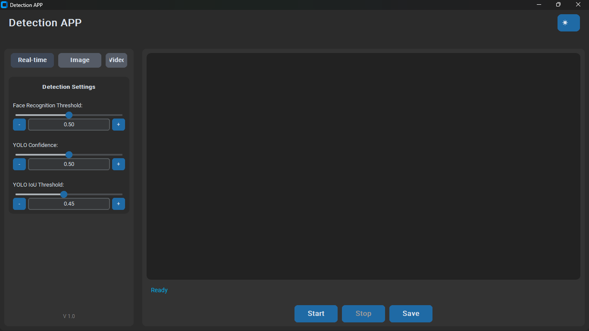
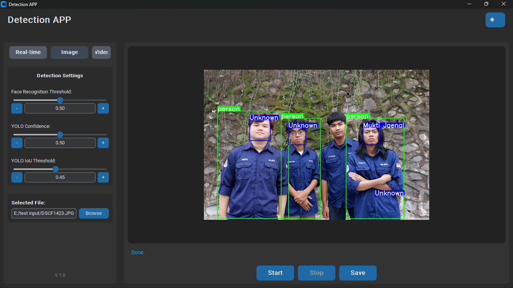

# Face Recognition & Object Detection System

A comprehensive real-time face recognition and object detection application with a modern GUI interface. This system combines YOLO object detection with face recognition capabilities for security, surveillance, and identification purposes.

## 📸 Overview
### Application Interface


### Image Object Detection Results


### Video Processing Demo


## 🌟 Features

### Core Functionality
- **Real-time Face Recognition**: Live webcam feed processing with instant face identification
- **Object Detection**: YOLO-powered detection of multiple object classes including persons
- **Multi-mode Processing**: Support for webcam, image, and video file processing
- **Efficient Video Processing**: Process videos with temporary file handling for quick saves
- **Known Face Management**: Encode and store known faces for recognition

### User Interface
- **Modern GUI**: Dark/Light theme toggle with CustomTkinter interface
- **Interactive Controls**: Real-time parameter adjustment with sliders and input fields
- **Live Preview**: Real-time display of processed frames during detection (600×400 preview)
- **Progress Tracking**: Status updates and processing feedback
- **Responsive Design**: Threaded processing keeps UI responsive during operations

### Advanced Settings
- **Adjustable Thresholds**: 
  - Face recognition confidence threshold (0.0 - 1.0)
  - YOLO detection confidence (0.0 - 1.0) 
  - YOLO IoU threshold for object detection (0.0 - 1.0)
- **Dynamic Controls**: Increment/decrement buttons (±0.1) and direct value input
- **Parameter Validation**: Real-time validation of input parameters
- **Visual Feedback**: Dynamic bounding boxes and labels with scaling

### File Management
- **Organized Output Structure**: 
  - `Input/` for source files
  - `Output/Image/` for processed images
  - `Output/Video/` for processed videos
- **Smart File Handling**: Hidden temporary files during video processing
- **Flexible Saving**: Choose custom names and locations for output files
- **Cross-platform Compatibility**: Hidden file attributes on Windows, dot-prefixed on Unix systems

## 🛠️ Technology Stack

### Computer Vision & AI
- **YOLO (Ultralytics)**: YOLOv8s model for state-of-the-art object detection
- **Face Recognition**: High-accuracy face encoding and matching using dlib
- **OpenCV**: Computer vision operations and video processing
- **NumPy**: Numerical computations and array operations

### GUI Framework
- **CustomTkinter**: Modern, customizable GUI components with dark/light themes
- **Tkinter**: Base GUI framework and file dialogs
- **PIL (Pillow)**: Image processing and display in GUI

### Core Libraries
- **Python 3.7+**: Primary programming language
- **Threading**: Concurrent processing for responsive UI
- **Pickle**: Face encodings serialization and storage
- **Shutil**: File operations and copying
- **OS**: File system operations and path handling

## 📋 Requirements

### System Requirements
- Python 3.7 or higher
- Webcam (for real-time mode)
- Windows/Linux/macOS compatible
- Minimum 4GB RAM recommended
- GPU support optional (CUDA for faster YOLO inference)

### Python Dependencies
```txt
ultralytics>=8.0.0
opencv-python>=4.5.0
face_recognition>=1.3.0
numpy>=1.21.0
Pillow>=8.0.0
customtkinter>=5.0.0
```

## 🚀 Installation

### 1. Clone the Repository
```bash
git clone https://github.com/Mukti-J/Face_Recognition.git
cd Face_Recognition
```

### 2. Install Dependencies
```bash
pip install -r requirements.txt
```

### 3. Download YOLO Model
The application will automatically download the YOLOv8s model on first run, or you can manually place it in:
```
models/yolov8s.pt
```

### 4. Set Up Known Faces
1. Create a `known_faces` directory
2. Create subdirectories for each person (e.g., `known_faces/john_doe/`)
3. Add face images (JPG, JPEG, PNG) to each person's folder
4. Run the encoding script:
```bash
python encode_faces.py
```

## 📖 Usage

### Starting the Application
```bash
python main.py
```

### GUI Interface

#### Mode Selection
- **Real-time**: Live webcam processing
- **Image**: Process single images
- **Video**: Process video files

#### Settings Panel
- **Face Recognition Threshold**: Adjust sensitivity (lower = more strict)
- **YOLO Confidence**: Object detection confidence threshold
- **YOLO IoU Threshold**: Intersection over Union for object detection

#### Controls
- **Start**: Begin processing with current settings
- **Stop**: Halt current processing operation
- **Save**: Save processed output to chosen location

### Command Line Options
```bash
python main.py --threshold 0.6
```

Available arguments:
- `--threshold`: Face recognition threshold (default: 0.5)

## 🏗️ Project Structure

```
newFaceRecognition/
├── main.py                    # Main application entry point
├── gui.py                     # GUI interface implementation
├── utils.py                   # Utility functions (drawing, resizing)
├── encode_faces.py            # Face encoding script
├── requirements.txt           # Python dependencies
├── known_faces/              # Directory for known face images
│   ├── person1/
│   │   ├── image1.jpg
│   │   └── image2.jpg
│   └── person2/
│       └── image1.jpg
├── Input/                    # Input files directory
├── Output/                   # Output files directory
│   ├── Image/               # Processed images
│   └── Video/               # Processed videos
├── models/                   # YOLO model files
│   └── yolov8s.pt
└── known_faces_encodings.pkl # Encoded face data
```

## ⚙️ Configuration

### Face Recognition Settings
- **Threshold Range**: 0.0 (strict) to 1.0 (permissive)
- **Recommended**: 0.4-0.6 for balanced accuracy
- **Lower values**: Reduce false positives, may miss valid matches
- **Higher values**: Increase detection rate, may increase false positives

### YOLO Detection Settings
- **Confidence**: Minimum confidence for object detection
- **IoU Threshold**: Non-maximum suppression threshold
- **Recommended Confidence**: 0.3-0.7 depending on use case
- **Recommended IoU**: 0.3-0.5 for optimal results

### Performance Optimization
- **Image Size**: Larger images provide better accuracy but slower processing
- **Video FPS**: Processing speed depends on resolution and frame rate
- **GPU Acceleration**: Install CUDA for faster YOLO inference

## 🔧 Advanced Features

### Video Processing Workflow
1. **Temporary Processing**: Videos are processed to hidden temporary files
2. **Live Preview**: Real-time preview during processing
3. **Quick Save**: Copy processed temporary file to final location
4. **Automatic Cleanup**: Temporary files cleaned on app exit

### Cross-Platform File Handling
- **Windows**: Uses `FILE_ATTRIBUTE_HIDDEN` for temporary files
- **Unix/Linux/macOS**: Prefixes temporary files with `.` (dot)
- **Error Handling**: Graceful fallback if file attributes cannot be set

### Threading Architecture
- **Main Thread**: GUI operations and user interactions
- **Processing Thread**: Video/image processing operations
- **Event System**: Clean thread termination with stop events

## 🐛 Troubleshooting

### Common Issues

#### Face Recognition Not Working
```bash
# Ensure face encodings exist
python encode_faces.py
```

#### YOLO Model Download Failed
- Check internet connection
- Manually download YOLOv8s model to `models/` directory

#### GUI Not Responding
- Ensure CustomTkinter is properly installed
- Check Python version compatibility (3.7+)

#### Poor Detection Accuracy
- Adjust confidence thresholds
- Ensure good lighting conditions
- Use higher resolution images/videos

### Performance Issues
- **Slow Processing**: Reduce video resolution or adjust YOLO confidence
- **High Memory Usage**: Process smaller batches or reduce model size
- **GUI Lag**: Ensure threading is working properly

### File Path Issues
- Use forward slashes or raw strings for file paths
- Ensure proper permissions for Input/Output directories
- Check file format compatibility (supported: JPG, JPEG, PNG, MP4, AVI, MOV, MKV)

## 🤝 Contributing

### Development Setup
1. Fork the repository from https://github.com/Mukti-J/Face_Recognition
2. Create a feature branch
3. Install development dependencies
4. Make changes and test thoroughly
5. Submit a pull request

### Code Style
- Follow PEP 8 guidelines
- Use meaningful variable names
- Add docstrings for functions
- Comment complex logic

### Testing
- Test all three modes (webcam, image, video)
- Verify cross-platform compatibility
- Test with various image/video formats

## 🙏 Acknowledgments

- **Ultralytics**: YOLOv8 implementation
- **dlib**: Face recognition library
- **CustomTkinter**: Modern GUI framework
- **OpenCV**: Computer vision library

## 📞 Support

For issues, questions, or contributions:
1. Check the troubleshooting section
2. Visit the GitHub repository: https://github.com/Mukti-J/Face_Recognition
3. Search existing issues
4. Create a new issue with detailed description
5. Include system information and error logs

---

**Repository**: https://github.com/Mukti-J/Face_Recognition  
**Version**: 1.0  
**Last Updated**: 8 Juni 2025  
**Python Version**: 3.7+  
**Platform**: Windows, Linux, macOS
